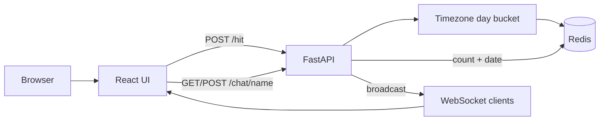
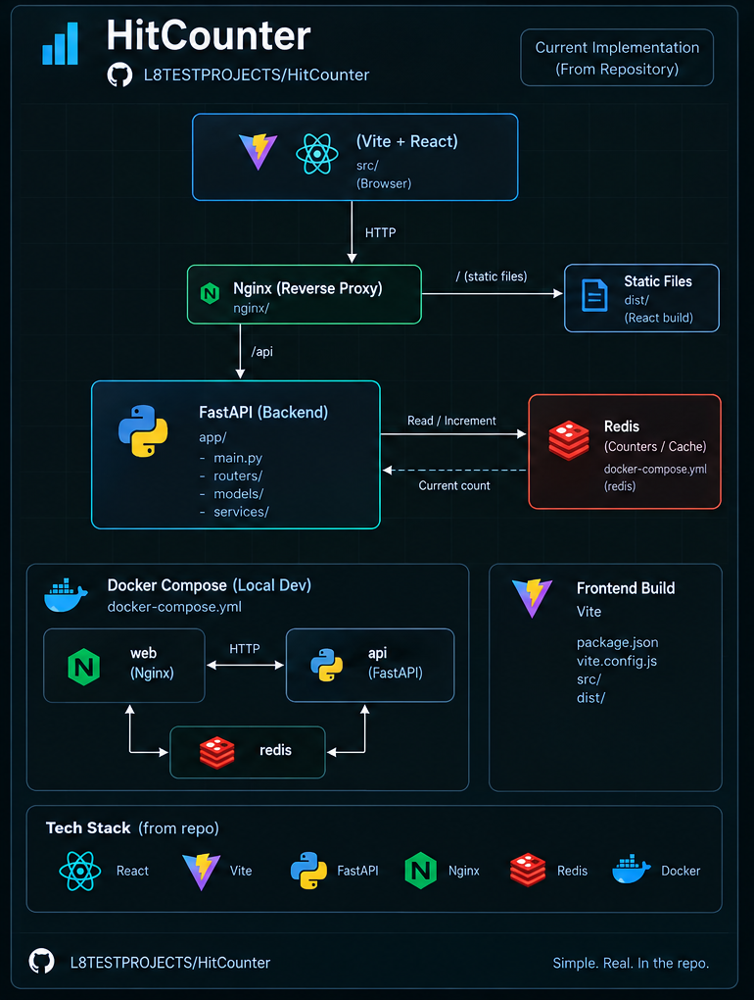

<div align="center">

# WebSocketChat

### A small real-time system for shared presence, daily signals, and chat-ready identity

The project started as a hit counter and is growing into a compact WebSocket playground: one browser registers a meaningful event, Redis keeps the daily truth, and every connected browser sees the update arrive live.

<p>
  
  
  
  
</p>

<p>
  <a href="#the-idea">The idea</a> |
  <a href="#how-it-works">How it works</a> |
  <a href="#system-visual">System visual</a> |
  <a href="#run-it-locally">Run it locally</a> |
  <a href="#repository-map">Repository map</a>
</p>

</div>

---

## The idea

Most real-time demos stop at “the browser received a message.” This project asks a more useful question:

> **Can a tiny event become shared, durable, time-bounded state without losing the feeling of immediacy?**

WebSocketChat explores that question through a deliberately small product surface:

- a daily unique hit counter, bucketed in a configurable timezone;
- a live WebSocket stream that keeps every connected view current;
- a lightweight chat identity flow that remembers a visitor's name for the retention window;
- a React interface that makes the system visible instead of hiding it behind a dashboard full of abstractions.

The result is not trying to be a finished social network. It is a clean little laboratory for presence, broadcast, Redis-backed coordination, reverse-proxied WebSockets, and the product details that make a real-time interaction feel coherent.

## What the product does today

| Surface | Behavior |
| --- | --- |
| Daily counter | Counts unique client IPs once per configured calendar day |
| Live updates | Broadcasts the new count and date to active WebSocket clients after a hit |
| Chat identity | Reads and stores a visitor name with a bounded Redis TTL |
| Counter view | Shows connection status, the current daily bucket, and a register-hit action |
| Chat view | Presents the identity gate that future message flows can build on |
| Local override | Allows deterministic development IPs when `ALLOW_DEV_IP_OVERRIDE=true` |

The chat page is intentionally an identity-first slice. The message timeline and composer are the next natural layer, not something this repository pretends to have already completed.

## How it works



### The counter loop

1. The browser opens `/ws` and receives the current count for today's bucket.
2. A hit request resolves the client IP and the configured timezone bucket.
3. Redis stores the seen-IP set and daily count using a transaction with optimistic retry.
4. The server broadcasts the resulting count to every active WebSocket client.
5. Redis TTLs keep the rolling history bounded by `RETENTION_DAYS`.

### The identity loop

1. The chat view asks `GET /chat/name` for the current visitor identity.
2. If no name exists, the UI opens the introduction dialog.
3. `POST /chat/name` stores a trimmed name for the same bounded retention window.
4. The interface is ready for a future message stream without coupling identity to browser-local state.

## Architecture at a glance

```text
                         WebSocket broadcast
                      +----------------------+
                      |                      v
Browser --> React UI --> FastAPI API --> Redis state
   |          |             |  ^             |
   |          |             |  |             |
   +----------+-------------+  +-------------+
        HTTP counter and identity requests
```

The outer repository intentionally keeps the two runtime pieces together:

- `server/` owns the API, Redis keys, uniqueness rules, TTLs, and WebSocket client set;
- `web/` owns the interaction model, routes, visual language, and client configuration;
- `docker-compose.yml` supplies the local network where the browser-facing web container can proxy to the API container.

## System visual

The current implementation is summarized in the diagram below. It shows the browser-facing React and Vite layer, Nginx as the production reverse proxy, the FastAPI backend, and Redis as the shared source for daily counter and visitor identity state.

<p align="center">
  
</p>

<p align="center"><em>One small event, one shared state, every connected client kept current.</em></p>

The Docker Compose section of the visual describes the local container topology. For the exact request paths, environment defaults, and independent development commands, keep [the API surface](#api-surface) and [configuration](#configuration) as the source of truth.

## API surface

| Method | Path | Purpose |
| --- | --- | --- |
| `GET` | `/health` | Liveness check |
| `GET` | `/count` | Read today's count and bucket metadata |
| `POST` | `/hit` | Register a unique daily hit and broadcast the result |
| `GET` | `/chat/name` | Read the current visitor's stored name |
| `POST` | `/chat/name` | Validate and store a visitor name |
| `WS` | `/ws` | Receive the current count and live updates |

Example WebSocket payloads:

```json
{"count": 42, "date": "2026-09-10"}
```

The HTTP API uses the request IP by default. Development can opt into the `X-Dev-Ip` header with an explicit environment flag, which makes repeatable local demos possible without changing production behavior.

## Run it locally

### Full stack with Docker Compose

```bash
docker compose up --build
```

The compose topology exposes:

| Service | Address | Role |
| --- | --- | --- |
| Web | `http://localhost:3001` | React build served by Nginx |
| API | `http://localhost:8081` | FastAPI and WebSocket endpoint |
| Redis | `localhost:6379` | Daily counter and chat identity state |

The web container proxies `/api/` and `/api/ws` to the internal API service, so the browser can use one origin in the containerized flow.

### Run the server independently

```bash
cd server
python -m venv .venv
source .venv/bin/activate
pip install -r requirements.txt
uvicorn app:app --host 0.0.0.0 --port 8080
```

Start Redis separately on `localhost:6379`, or provide a different `REDIS_URL`.

### Run the web app independently

```bash
cd web
npm install
npm run dev
```

The Vite dev server runs on `http://localhost:3000`. During development the client defaults to the API and WebSocket on port `8080`; override them when needed:

```bash
VITE_API_BASE=http://localhost:8080 \
VITE_WS_URL=ws://localhost:8080/ws \
npm run dev
```

## Configuration

| Variable | Default | Purpose |
| --- | --- | --- |
| `REDIS_URL` | `redis://redis:6379/0` | Redis connection string |
| `BUCKET_TZ` | `America/New_York` | Calendar timezone for daily buckets |
| `RETENTION_DAYS` | `7` | TTL window for counters and names |
| `ALLOW_DEV_IP_OVERRIDE` | `false` | Accept `X-Dev-Ip` for local scenarios |
| `DEV_CORS` | `false` | Enable permissive development CORS |
| `VITE_API_BASE` | Environment-dependent | HTTP API base URL for the web client |
| `VITE_WS_URL` | Environment-dependent | WebSocket URL for the web client |

For deployed environments, keep `DEV_CORS=false` and `ALLOW_DEV_IP_OVERRIDE=false`. Configure the real web origin in the server CORS allowlist before shipping.

## Repository map

```text
hit-counter/
|- server/
|  |- app.py              FastAPI routes, Redis state, and WebSocket broadcast
|  |- requirements.txt     Python runtime dependencies
|  `- Dockerfile           API image
|- web/
|  |- src/pages/           Counter and chat experiences
|  |- nginx.conf            SPA fallback and API/WebSocket proxy
|  `- Dockerfile            Vite build plus Nginx runtime
|- docs/
|  `- cloud-deployment.md   AWS EKS, ECR, ALB, and ElastiCache notes
|- docker-compose.yml       Local multi-service topology
`- README.md                Product and architecture entry point
```

## What this project is exploring

WebSocketChat is intentionally small enough to understand end to end, but real enough to expose the interesting edges:

- daily uniqueness is different from a raw request counter;
- timezone boundaries are product behavior, not just formatting;
- Redis transactions and retries matter when multiple clients arrive together;
- a WebSocket connection needs an initial snapshot as well as future updates;
- a proxy must preserve WebSocket upgrade headers;
- temporary identity still needs validation, retention, and a clear failure state;
- a chat-ready interface benefits from a real identity flow before messages exist.

That combination makes the repository useful as both a product prototype and a compact systems-learning project.

## Deployment notes

The current deployment guide describes a production-shaped AWS path using EKS, ECR, an ALB, ACM, Route 53, and ElastiCache for Redis. It lives in [docs/cloud-deployment.md](./docs/cloud-deployment.md).

The guide is intentionally a blueprint rather than an automated deployment. Review domain names, CORS origins, Redis TLS requirements, secrets, and image tags before using it in an account.

## Status

The counter and identity flows are implemented. The chat surface is prepared for a future message stream, while the current backend focuses on presence-like state and realtime broadcast.

## License

No open-source license has been selected yet. Treat this repository as a private learning and product workspace unless a license is added.
